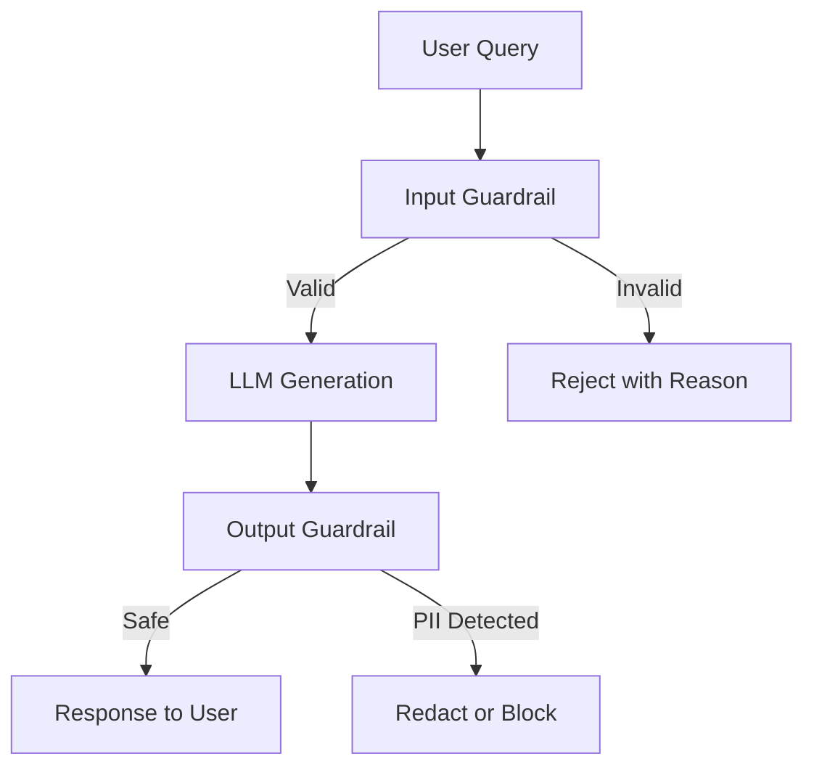

# AI DIAL Guardrails Documentation

> **Educational Project**: Hands-on implementation of LLM security guardrails demonstrating prompt injection defense, input validation, and PII leak prevention.

## 📚 Table of Contents

- [Overview](#overview)
- [Quick Start](#quick-start)
- [Documentation Structure](#documentation-structure)
- [Key Concepts](#key-concepts)
- [Learning Path](#learning-path)
- [Getting Help](#getting-help)

## Overview

The AI DIAL Guardrails project is a hands-on educational repository designed to teach LLM security best practices through progressive implementation tasks. It demonstrates three critical guardrail strategies:

1. **Prompt Injection Exploration** - Understanding attack vectors and system prompt hardening
2. **Input Validation** - LLM-based detection of malicious queries before generation
3. **Output Validation** - Post-generation PII leak detection and streaming redaction

### Why This Project?

- **Educational**: Learn by implementing guardrails with realistic attack scenarios
- **Progressive**: Three tasks building from exploration to production-ready patterns
- **Practical**: Uses LangChain, Azure OpenAI (via DIAL proxy), and Presidio
- **Real-World**: Demonstrates layered defense and trade-offs between security and UX

### Project Status

- ✅ Core infrastructure and task scaffolding complete
- ✅ Reference implementations with comprehensive inline documentation
- ✅ 16+ prompt injection attack examples for testing
- 🚧 Production framework integration (guardrails-ai) pending

## Quick Start

### Prerequisites

- Python 3.11+
- EPAM VPN access (DIAL API endpoint)
- DIAL API key from EPAM support

### 5-Minute Setup

```bash
# Clone and navigate
cd ai-dial-guardrails

# Create virtual environment
python3.11 -m venv dial_guardrails
source dial_guardrails/bin/activate

# Install dependencies
pip install -r requirements.txt

# Configure API access
export DIAL_API_KEY='your-key-here'

# Run first task
python tasks/t_1/prompt_injection.py
```

For detailed setup instructions, see [setup.md](./setup.md).

## Documentation Structure

This documentation is organized for progressive learning and quick reference:

| Document | Purpose | Audience |
|----------|---------|----------|
| [Architecture](./architecture.md) | System design, data flow, module boundaries | Developers, architects |
| [Setup](./setup.md) | Environment configuration, tooling, commands | All users |
| [API Reference](./api.md) | Public interfaces, classes, functions | Developers |
| [Testing](./testing.md) | Test strategy, coverage, how to run tests | Developers, QA |
| [ADR Directory](./adr/) | Architecture decision records | Architects, contributors |
| [Glossary](./glossary.md) | Domain terms, abbreviations | All users |
| [Roadmap](./roadmap.md) | Milestones, backlog, risk register | Project managers, contributors |

## Key Concepts

### Guardrail Layers



### Task Progression

1. **Task 1: Prompt Injection Exploration** ([t_1/](../tasks/t_1/))
   - Understand attack vectors from [PROMPT_INJECTIONS_TO_TEST.md](../tasks/PROMPT_INJECTIONS_TO_TEST.md)
   - Test system prompt resistance
   - Learn PII exposure risks

2. **Task 2: Input Validation** ([t_2/](../tasks/t_2/))
   - Implement LLM-based input validator
   - Use Pydantic for structured validation output
   - Block malicious queries before generation

3. **Task 3: Output Protection** ([t_3/](../tasks/t_3/))
   - Part A: LLM-based output validation
   - Part B: Streaming PII redaction with Presidio

### Technology Stack

- **LangChain**: Message abstractions, LLM clients, output parsers
- **Azure OpenAI (via DIAL)**: `gpt-4.1-nano-2025-04-14` model
- **Presidio**: NLP-based PII detection and anonymization
- **Pydantic**: Structured validation result schemas

## Learning Path

### For Security Engineers

1. Start with [Glossary](./glossary.md) to understand threat models
2. Read [Architecture](./architecture.md) for guardrail patterns
3. Implement Task 2 and 3 validators
4. Review [ADR-001](./adr/ADR-001-llm-based-validation.md) for design rationale

### For ML Engineers

1. Read [API Reference](./api.md) for LangChain patterns
2. Run Task 1 to see attack vectors
3. Implement streaming guardrail in Task 3
4. Explore Presidio NLP engine integration

### For Product Managers

1. Read this README and [Roadmap](./roadmap.md)
2. Review [ADR-002](./adr/ADR-002-streaming-architecture.md) for UX trade-offs
3. Understand success criteria in main [README.md](../README.md)

## Getting Help

### Common Issues

- **DIAL API Connection Errors**: Ensure VPN is connected and `DIAL_API_KEY` is set
- **Presidio Import Errors**: Run `python -m spacy download en_core_web_sm`
- **Parser Errors in Validation**: Check LLM output format matches Pydantic schema

### Resources

- Main README: [../README.md](../README.md)
- Copilot Instructions: [../.github/copilot-instructions.md](../.github/copilot-instructions.md)
- Attack Examples: [../tasks/PROMPT_INJECTIONS_TO_TEST.md](../tasks/PROMPT_INJECTIONS_TO_TEST.md)

### Contributing

This is an educational project. For improvements:

1. Review existing [ADRs](./adr/) for design context
2. Add tests (see [Testing](./testing.md))
3. Update documentation inline (see [Copilot Instructions](../.github/copilot-instructions.md))

---

**Next Steps**: Continue to [Architecture](./architecture.md) for system design or [Setup](./setup.md) to configure your environment.
