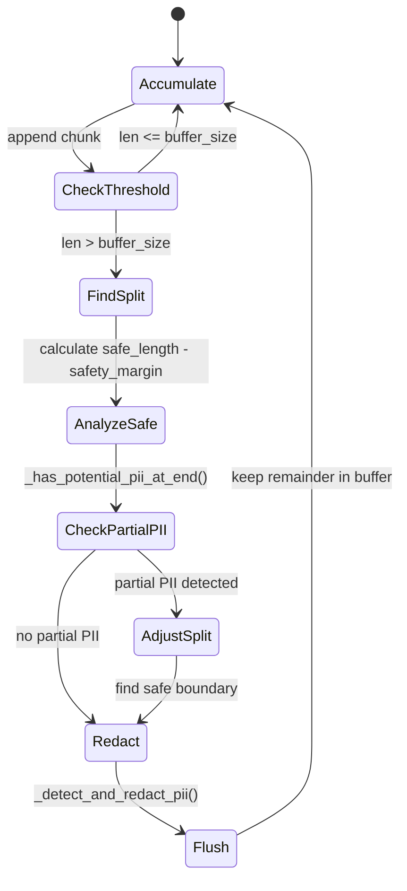

# ADR-002: Streaming Guardrail Architecture

## Status
Accepted (2025-12-31)

## Context

Modern LLM applications use **streaming responses** to reduce perceived latency and improve user experience. Users see partial responses as they're generated rather than waiting for complete responses.

### Problem Statement

With streaming, PII guardrails face new challenges:

1. **Incremental Processing**: Text arrives in small chunks; PII may span multiple chunks
2. **Boundary Conditions**: Credit card `4111 1111` in chunk N, ` 1111 1111` in chunk N+1
3. **Real-Time Requirement**: Redaction must happen before displaying chunk to user
4. **Buffer Management**: Need to hold back text that might be partial PII
5. **Latency Trade-off**: Larger buffers increase safety but delay output

### Use Case

Task 3B demonstrates real-time PII redaction for streaming LLM responses:
```python
for chunk in llm.stream(messages):
    safe_chunk = guardrail.process_chunk(chunk.content)
    if safe_chunk:
        print(safe_chunk, end='', flush=True)  # Real-time display
```

## Decision

**We will implement a buffered streaming guardrail with configurable safety margins.**

Architecture:
- **Accumulation Phase**: Buffer chunks until threshold reached
- **Analysis Phase**: Scan accumulated text for PII
- **Safe Split Phase**: Find split point that doesn't truncate PII
- **Flush Phase**: Output redacted safe portion, keep remainder in buffer
- **Finalize Phase**: Process remaining buffer on stream end

Implementation:
```python
class StreamingPIIGuardrail:
    def __init__(self, buffer_size: int = 100, safety_margin: int = 20):
        self.buffer = ""
        self.buffer_size = buffer_size
        self.safety_margin = safety_margin
    
    def process_chunk(self, chunk: str) -> str:
        # Accumulate, analyze, flush cycle
        ...
    
    def finalize(self) -> str:
        # Process remaining buffer
        ...
```

Two implementations provided:
1. **StreamingPIIGuardrail**: Regex-based (fast, simple)
2. **PresidioStreamingPIIGuardrail**: NLP-based (accurate, complex)

## Consequences

### Positive

1. **Real-Time UX**: Users see redacted output immediately (streaming maintained)
2. **Boundary Safety**: Safety margin prevents splitting PII across chunks
3. **Configurable**: `buffer_size` and `safety_margin` tunable for use case
4. **Dual Implementation**: Regex (fast) and Presidio (accurate) options
5. **Educational Value**: Demonstrates streaming guardrail complexity

### Negative

1. **Delayed Output**: Safety margin introduces ~20-100 char latency
2. **Complexity**: Buffer management logic is non-trivial (edge cases)
3. **Split PII Risk**: Insufficient safety margin may miss PII at boundaries
4. **Performance Overhead**: Presidio NLP analysis adds ~100-200ms per flush
5. **False Negatives**: Regex patterns may miss obfuscated PII

### Trade-offs Accepted

- **Latency vs. Safety**: Accept output delay for PII boundary protection
- **Simplicity vs. Accuracy**: Provide both regex (simple) and Presidio (accurate)
- **Memory vs. Coverage**: Larger buffer = better detection but more memory

## Alternatives Considered

### Alternative 1: No Buffering (Chunk-by-Chunk Processing)

**Approach**: Analyze each chunk individually without buffering.

**Pros**:
- Zero latency overhead
- Simplest implementation
- Minimal memory usage

**Cons**:
- **High false negatives**: PII split across chunks not detected
- Example: Chunk 1: `"SSN: 890-"` → passes; Chunk 2: `"12-3456"` → passes; Full: `"SSN: 890-12-3456"` → missed
- **Unreliable**: Core security requirement violated

**Reason for Rejection**: Unacceptable false negative rate; defeats guardrail purpose.

### Alternative 2: Wait for Full Response

**Approach**: Buffer entire response, analyze after stream completes, then display.

**Pros**:
- Perfect detection (no boundary issues)
- Simpler logic (no incremental processing)
- Can use LLM-based output validation

**Cons**:
- **Defeats streaming UX**: User sees no output until generation complete
- High latency (seconds to minutes for long responses)
- Same as non-streaming approach

**Reason for Rejection**: Loses streaming benefit; user experience degraded.

### Alternative 3: Lookbehind Window Only

**Approach**: Maintain small lookbehind window (last N chars) and scan chunk + window.

**Pros**:
- Lower latency than full buffer
- Catches PII spanning 2 chunks

**Cons**:
- **Limited coverage**: PII spanning > 2 chunks missed
- Example: Chunk 1: `"4111 "`, Chunk 2: `"1111 "`, Chunk 3: `"1111 1111"` → missed
- **Fixed window size**: Hard to tune for all PII types

**Reason for Rejection**: Insufficient coverage; window size guesswork.

### Alternative 4: Post-Generation Correction

**Approach**: Display chunks as received, then retroactively redact/correct displayed text.

**Pros**:
- Zero streaming latency
- Perfect detection (full text available)

**Cons**:
- **PII already displayed**: User may see sensitive data briefly
- Complex UI (text replacement/scrollback manipulation)
- **Security failure**: PII exposure, even if brief

**Reason for Rejection**: Violates core security requirement (no PII exposure).

### Alternative 5: Dual-Pass Streaming

**Approach**: Stream to hidden buffer, analyze, then display redacted stream with delay.

**Pros**:
- Perfect detection
- Maintains streaming appearance

**Cons**:
- Artificial latency (delay between generation and display)
- Complex implementation (parallel buffers)
- Higher memory usage (dual buffers)
- Essentially equivalent to Alternative 2 with UX illusion

**Reason for Rejection**: Over-engineered; delay defeats streaming benefit.

## Implementation Notes

### Buffer Management Algorithm



### Safety Margin Rationale

**buffer_size = 100**: Sufficient to contain most PII patterns (credit cards ~19 digits, SSN ~11 chars)

**safety_margin = 20**: Prevents splitting PII at boundary:
- Credit card: 16-19 digits + spaces = ~23 chars
- SSN: 9 digits + hyphens = 11 chars
- Address: ~30-50 chars

With 20-char margin, most PII types remain intact in buffer.

### Presidio Integration

Presidio provides NLP-based entity recognition superior to regex:

**Advantages**:
- Recognizes PII in natural language context
- Handles variations (SSN: `890-12-3456` vs. `89012356` vs. `890 12 3456`)
- Pre-trained on diverse PII patterns
- Detects entity types (NAME, SSN, CREDIT_CARD, etc.)

**Setup**:
```bash
pip install presidio-analyzer presidio-anonymizer
python -m spacy download en_core_web_sm
```

**Performance**: ~100-200ms per analysis (NLP overhead)

### Regex Patterns

`StreamingPIIGuardrail._pii_patterns` provides baseline regex patterns:
- SSN: `\d{3}[-\s]?\d{2}[-\s]?\d{4}`
- Credit Card: `\d{4}[-\s]?\d{4}[-\s]?\d{4}[-\s]?\d{4}`
- Driver's License: `[A-Z]{2}-DL-[A-Z0-9]+`
- Address: Street patterns with qualifiers (Ave, St, Blvd)
- Currency: `$[\d,]+`

See [tasks/t_3/streaming_pii_guardrail.py](../../tasks/t_3/streaming_pii_guardrail.py) for full implementation.

## Testing Strategy

### Boundary Test Cases

1. **PII Split Across 2 Chunks**:
   - Chunk 1: `"Her SSN is 890-"`
   - Chunk 2: `"12-3456"`
   - Expected: `"Her SSN is [REDACTED-SSN]"`

2. **PII Split Across 3+ Chunks**:
   - Chunk 1: `"Card: 4111 "`
   - Chunk 2: `"1111 "`
   - Chunk 3: `"1111 1111"`
   - Expected: `"Card: [REDACTED-CREDIT-CARD]"`

3. **Partial PII at Buffer Boundary**:
   - Buffer: `"Address: 1537 Riverside Ave"` (ends at edge)
   - Next chunk: `"nue, Seattle, WA"`
   - Expected: Wait for complete address before flushing

4. **No PII - Fast Flush**:
   - Chunks of safe text
   - Expected: Flush after buffer_size with safety_margin retained

### Performance Benchmarks

| Implementation | Latency (per flush) | Memory | Accuracy |
|----------------|---------------------|--------|----------|
| Regex | ~5-10ms | Low | 85-90% |
| Presidio | ~100-200ms | Medium | 95-98% |

## Future Considerations

### Potential Improvements

1. **Adaptive Buffering**: Adjust buffer_size based on detected PII frequency
2. **Multi-Pass Presidio**: Run Presidio on overlapping windows for higher accuracy
3. **Streaming LLM Validator**: Use streaming LLM to validate chunks (experimental)
4. **Statistical Analysis**: Track PII detection patterns to optimize buffer params
5. **Parallel Processing**: Analyze buffer in background thread while accumulating

### Supersession Triggers

This ADR may be superseded if:
- Streaming PII detection libraries with zero-latency emerge
- LLM streaming APIs provide native PII filtering
- Regulatory requirements mandate post-generation validation only
- Performance benchmarks show unacceptable latency (> 500ms per flush)

## References

- [Microsoft Presidio Documentation](https://microsoft.github.io/presidio/)
- [spaCy NLP Library](https://spacy.io/)
- [LangChain Streaming](https://python.langchain.com/docs/modules/model_io/llms/streaming_llm)
- Task Implementation: [tasks/t_3/streaming_pii_guardrail.py](../../tasks/t_3/streaming_pii_guardrail.py)

---

**Related ADRs**:
- [ADR-003: Layered Defense Strategy](./ADR-003-layered-defense.md) - Multi-layer security architecture
- [ADR-004: Presidio Integration](./ADR-004-presidio-integration.md) - NLP-based PII detection rationale
