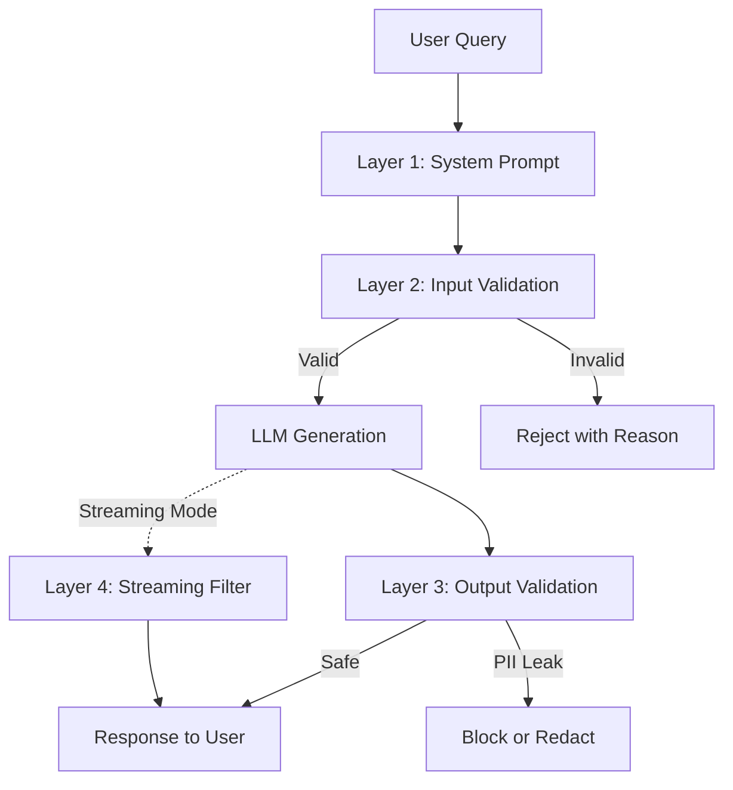

# ADR-003: Layered Defense Strategy

## Status
Accepted (2025-12-31)

## Context

LLM security requires robust protection against prompt injection attacks and PII leakage. No single guardrail mechanism is foolproof; sophisticated attacks can bypass individual layers.

### Threat Landscape

1. **Prompt Injection**: Attempts to override system instructions and extract restricted data
2. **Multi-Turn Attacks**: Building context over multiple turns to bypass safeguards
3. **Jailbreak Techniques**: Roleplay, pretend scenarios, instruction manipulation
4. **Social Engineering**: Convincing assistant to share data under false pretenses
5. **Structured Injection**: JSON, XML, SQL, CSV templates that trick parsing

### Single-Layer Vulnerabilities

- **System Prompt Only**: Bypassable via sophisticated injection
- **Input Validation Only**: Multi-turn attacks can establish malicious context
- **Output Validation Only**: Allows malicious queries through, wastes generation cycles

## Decision

**We will implement a layered defense (defense-in-depth) architecture with multiple independent guardrail mechanisms.**

Architecture layers (in order of execution):

1. **System Prompt Hardening**: Explicit constraints and refusal patterns
2. **Input Validation**: LLM-based pre-generation query analysis
3. **Output Validation**: LLM-based post-generation PII leak detection
4. **Streaming Filter**: Real-time PII redaction during generation (optional)



**Design Principle**: Each layer operates independently; bypass of one layer doesn't compromise others.

## Consequences

### Positive

1. **Defense-in-Depth**: Multiple opportunities to catch threats
2. **Resilience**: Single layer failure doesn't compromise system
3. **Complementary Coverage**: Each layer catches different attack types
4. **Educational Value**: Demonstrates comprehensive security architecture
5. **Flexibility**: Layers can be enabled/disabled based on requirements

### Negative

1. **Latency**: Multiple LLM calls add cumulative delay (~2-4 seconds)
2. **Cost**: Multiple validations increase API expenses (2-3x)
3. **Complexity**: More code to maintain and test
4. **Over-blocking**: Conservative layers may increase false positives
5. **Coordination**: Layers must be tested together for interaction effects

### Trade-offs Accepted

- **Latency vs. Security**: Accept slower responses for higher security
- **Cost vs. Coverage**: Accept higher API costs for broader protection
- **Simplicity vs. Robustness**: Accept complexity for defense-in-depth
- **UX vs. Safety**: Prioritize security over seamless user experience

## Layer Details

### Layer 1: System Prompt Hardening

**Purpose**: First line of defense; instructions to LLM about role and constraints.

**Mechanism**:
- Explicit allow-list (name, phone, email)
- Explicit deny-list (SSN, credit card, address, etc.)
- Prompt injection defense rules
- Refusal patterns

**Strengths**:
- Zero latency overhead
- Works for simple attacks
- User-transparent

**Weaknesses**:
- Vulnerable to sophisticated injections
- Relies on LLM instruction-following
- No guarantee of enforcement

**Implementation**: See `SYSTEM_PROMPT` in [tasks/t_1/prompt_injection.py](../../tasks/t_1/prompt_injection.py)

---

### Layer 2: Input Validation (Pre-Generation)

**Purpose**: Analyze user queries for malicious intent before generation.

**Mechanism**:
- Dedicated validator LLM with security-focused prompt
- Pydantic structured output (`ValidationResult`)
- Block queries that fail validation

**Strengths**:
- Prevents malicious queries from reaching generation
- Provides explicit rejection reasons
- Independent of main LLM behavior

**Weaknesses**:
- Adds ~1-2 seconds latency
- Validator itself can be tricked
- False positives possible

**Implementation**: See [ADR-001: LLM-Based Validation](./ADR-001-llm-based-validation.md) and [tasks/t_2/input_llm_based_validation.py](../../tasks/t_2/input_llm_based_validation.py)

---

### Layer 3: Output Validation (Post-Generation)

**Purpose**: Audit LLM responses for PII leaks after generation.

**Mechanism**:
- Dedicated validator LLM scans response for PII
- Pydantic structured output (`OutputValidationResult`)
- Block (hard) or redact (soft) responses with leaks

**Strengths**:
- Catches PII leaks even if input validation bypassed
- Defense-in-depth (second chance)
- Configurable response (block vs. redact)

**Weaknesses**:
- Adds ~1-2 seconds latency
- Entire generation wasted if blocked
- Redaction quality depends on detection accuracy

**Modes**:
- **Hard Block**: Reject response entirely, show generic error
- **Soft Redact**: Replace PII with `[REDACTED]` markers

**Implementation**: See [tasks/t_3/output_llm_based_validation.py](../../tasks/t_3/output_llm_based_validation.py)

---

### Layer 4: Streaming Filter (Real-Time)

**Purpose**: Real-time PII redaction during streaming generation.

**Mechanism**:
- Buffer chunks incrementally
- Analyze accumulated text for PII (regex or Presidio)
- Flush safe (redacted) portions
- Maintain safety margin to avoid splitting PII

**Strengths**:
- Low user-perceived latency (streaming maintained)
- Catches PII in real-time
- Works with streaming APIs

**Weaknesses**:
- Complex buffering logic
- Safety margin trade-off (UX vs. security)
- PII split across chunks may slip through

**Implementations**:
- `StreamingPIIGuardrail`: Regex-based (fast, ~85% accuracy)
- `PresidioStreamingPIIGuardrail`: NLP-based (slower, ~95% accuracy)

**Implementation**: See [ADR-002: Streaming Architecture](./ADR-002-streaming-architecture.md) and [tasks/t_3/streaming_pii_guardrail.py](../../tasks/t_3/streaming_pii_guardrail.py)

## Attack Coverage Matrix

| Attack Vector | Layer 1 | Layer 2 | Layer 3 | Layer 4 |
|---------------|---------|---------|---------|---------|
| **Instruction Override** | 🟡 Partial | 🟢 Effective | 🟢 Effective | N/A |
| **Structured Injection** | 🔴 Ineffective | 🟢 Effective | 🟢 Effective | N/A |
| **Jailbreak Roleplay** | 🟡 Partial | 🟢 Effective | 🟢 Effective | N/A |
| **Many-Shot Attack** | 🔴 Ineffective | 🟡 Partial | 🟢 Effective | N/A |
| **Context Saturation** | 🔴 Ineffective | 🟡 Partial | 🟢 Effective | N/A |
| **Multi-Turn Attack** | 🔴 Ineffective | 🟡 Partial | 🟢 Effective | N/A |
| **PII Leak (Direct)** | 🟡 Partial | N/A | 🟢 Effective | 🟢 Effective |
| **PII Leak (Split)** | 🔴 Ineffective | N/A | 🟡 Partial | 🟡 Partial |

**Legend**:
- 🟢 Effective: Reliably blocks/mitigates attack
- 🟡 Partial: Blocks some attacks, bypasses possible
- 🔴 Ineffective: Attack easily bypasses layer

**Key Insight**: No single layer is sufficient; combination provides comprehensive coverage.

## Alternatives Considered

### Alternative 1: Single-Layer (System Prompt Only)

**Approach**: Rely solely on system prompt constraints.

**Pros**:
- Simplest implementation
- Zero latency overhead
- Minimal API costs

**Cons**:
- **Highly vulnerable** to prompt injection
- No defense-in-depth
- Single point of failure

**Reason for Rejection**: Insufficient for educational demonstration; shows vulnerability, not mitigation.

---

### Alternative 2: Input Validation Only

**Approach**: Block malicious queries, no output validation.

**Pros**:
- Prevents most attacks at input
- Lower latency than full layering
- Lower API costs

**Cons**:
- **Multi-turn attacks** bypass input validation
- No safety net for LLM misbehavior
- False negatives lead to PII leaks

**Reason for Rejection**: Leaves gap for multi-turn and context-based attacks.

---

### Alternative 3: Output Validation Only

**Approach**: No input validation, audit outputs after generation.

**Pros**:
- Catches all PII leaks (final checkpoint)
- Simpler than full layering
- No false positives on input

**Cons**:
- **Wasted generation cycles** (malicious queries still processed)
- Higher API costs (generate then discard)
- Higher latency (generate + validate)
- Allows attack queries through

**Reason for Rejection**: Inefficient; allows malicious queries to consume resources.

---

### Alternative 4: Streaming Filter Only

**Approach**: No validation, rely on real-time redaction.

**Pros**:
- Low latency (streaming maintained)
- Simpler than full layering

**Cons**:
- **Regex limitations**: Low accuracy (~85%)
- **Presidio overhead**: High latency (~100-200ms per flush)
- No protection against non-PII attacks
- Split PII may slip through

**Reason for Rejection**: Insufficient as sole layer; best as complementary Layer 4.

## Implementation Guidelines

### Layer Activation

**Required Layers** (minimum viable security):
- Layer 1: System Prompt
- Layer 2: Input Validation
- Layer 3: Output Validation

**Optional Layer** (UX enhancement):
- Layer 4: Streaming Filter (if streaming API used)

### Configuration

```python
# Layer configuration
ENABLE_INPUT_VALIDATION = True   # Layer 2
ENABLE_OUTPUT_VALIDATION = True  # Layer 3
OUTPUT_VALIDATION_MODE = "hard"  # "hard" (block) or "soft" (redact)
ENABLE_STREAMING_FILTER = False  # Layer 4 (only if streaming)
```

### Testing Strategy

1. **Layer Isolation**: Test each layer independently
2. **Layer Combination**: Test interactions between layers
3. **Bypass Attempts**: Test if attacks caught by Layer N can bypass Layer N+1
4. **Performance**: Measure cumulative latency across all layers

## Future Considerations

### Potential Improvements

1. **Layer Prioritization**: Skip Layer 3 if Layer 2 blocks query (optimization)
2. **Parallel Validation**: Run input + generation + output in pipeline
3. **Adaptive Layers**: Enable/disable layers based on query risk score
4. **Logging & Monitoring**: Centralized logging of layer decisions
5. **Metrics Dashboard**: Track layer effectiveness and false positive/negative rates

### Supersession Triggers

This ADR may be superseded if:
- Single-layer solutions achieve > 99% attack detection
- Latency requirements prohibit multi-layer approach
- Regulatory requirements mandate specific layer configurations
- Production frameworks (e.g., `guardrails-ai`) provide equivalent layering

## References

- [OWASP Defense in Depth](https://owasp.org/www-community/Defense_in_depth)
- [NIST Cybersecurity Framework](https://www.nist.gov/cyberframework)
- [Microsoft Security Development Lifecycle](https://www.microsoft.com/en-us/securityengineering/sdl)
- Task Implementations:
  - [Task 1: Prompt Injection](../../tasks/t_1/prompt_injection.py)
  - [Task 2: Input Validation](../../tasks/t_2/input_llm_based_validation.py)
  - [Task 3: Output Validation](../../tasks/t_3/output_llm_based_validation.py)
  - [Task 3: Streaming Filter](../../tasks/t_3/streaming_pii_guardrail.py)

---

**Related ADRs**:
- [ADR-001: LLM-Based Validation](./ADR-001-llm-based-validation.md) - Input validation rationale
- [ADR-002: Streaming Architecture](./ADR-002-streaming-architecture.md) - Streaming filter design
