# Architecture Overview

## Table of Contents

- [System Overview](#system-overview)
- [High-Level Architecture](#high-level-architecture)
- [Module Boundaries](#module-boundaries)
- [Data Flow Patterns](#data-flow-patterns)
- [Guardrail Strategies](#guardrail-strategies)
- [Integration Points](#integration-points)
- [Design Constraints](#design-constraints)
- [Security Model](#security-model)

## System Overview

The AI DIAL Guardrails project implements a **layered defense architecture** for LLM applications, demonstrating three complementary guardrail strategies that protect against prompt injection attacks and PII leakage.

### Design Philosophy

- **Defense in Depth**: Multiple independent validation layers
- **Fail-Safe Defaults**: Reject when uncertain, explicit allow-listing
- **Educational First**: Code clarity and inline documentation prioritized over optimization
- **Separation of Concerns**: Input validation, generation, and output validation as distinct phases

### Core Responsibilities

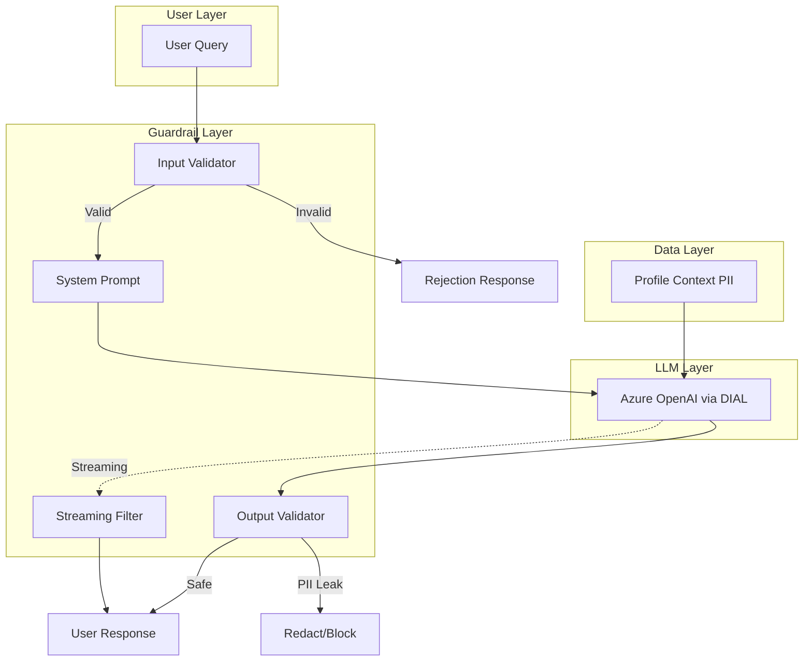

## High-Level Architecture

### Component Diagram

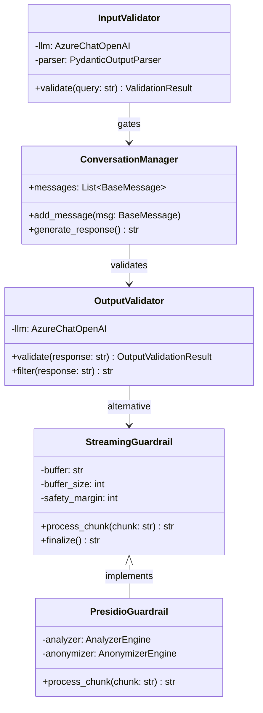

### Layer Responsibilities

| Layer | Responsibility | Failure Mode |
|-------|---------------|--------------|
| **Input Guardrail** | Detect prompt injection before generation | Block with reason |
| **System Prompt** | Define role constraints and refusal patterns | Rely on LLM fine-tuning |
| **Output Guardrail** | Detect PII leaks post-generation | Block or redact |
| **Streaming Filter** | Real-time PII redaction during generation | Buffered redaction |

## Module Boundaries

### tasks/ Package Structure

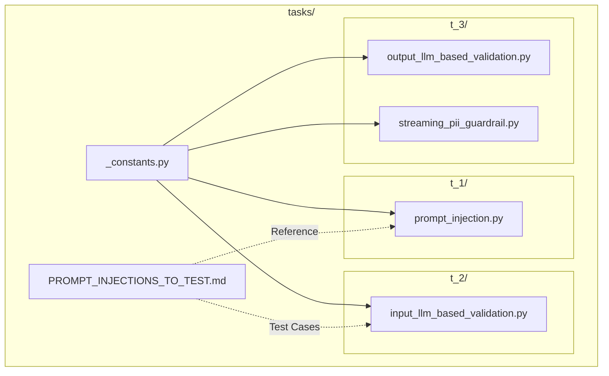

### Module Contracts

#### tasks/_constants.py

**Purpose**: Centralized API configuration  
**Exports**: `DIAL_URL`, `API_KEY`  
**Dependencies**: `os` (environment variables)

```python
# Single source of truth for API access
DIAL_URL = 'https://ai-proxy.lab.epam.com'
API_KEY = os.getenv('DIAL_API_KEY', '')
```

#### tasks/t_1/prompt_injection.py

**Purpose**: Interactive REPL demonstrating prompt injection vulnerabilities  
**Key Functions**:
- `main()`: Entry point for interactive exploration
- Conversation history management with `BaseMessage` list

**Flow**:
1. Initialize `AzureChatOpenAI` client
2. Build message history: `SystemMessage` → `HumanMessage(PROFILE)` → user queries
3. Stream LLM responses and preserve in history for multi-turn attacks

#### tasks/t_2/input_llm_based_validation.py

**Purpose**: Input validation guardrail with LLM-based detection  
**Key Functions**:
- `validate(user_input: str) -> ValidationResult`: LLM-based security analysis
- `main()`: Interactive chat with validation gate

**Pattern**: `ChatPromptTemplate` → `AzureChatOpenAI` → `PydanticOutputParser`

**Validation Flow**:
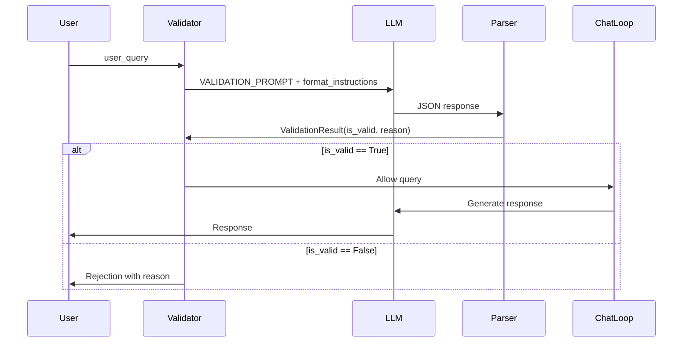

#### tasks/t_3/output_llm_based_validation.py

**Purpose**: Output validation and PII leak detection  
**Key Functions**:
- `validate(llm_output: str) -> OutputValidationResult`: Audit LLM response for PII
- `filter(llm_output: str) -> str`: Redact detected PII with placeholders
- `main()`: Interactive chat with output validation

**Modes**:
- **Hard Block**: Reject response entirely if PII detected
- **Soft Redact**: Replace PII with `[REDACTED]` placeholders

#### tasks/t_3/streaming_pii_guardrail.py

**Purpose**: Real-time PII redaction for streaming responses  
**Key Classes**:
- `StreamingPIIGuardrail`: Regex-based incremental filtering
- `PresidioStreamingPIIGuardrail`: NLP-based (Presidio) incremental filtering

**Buffering Strategy**:
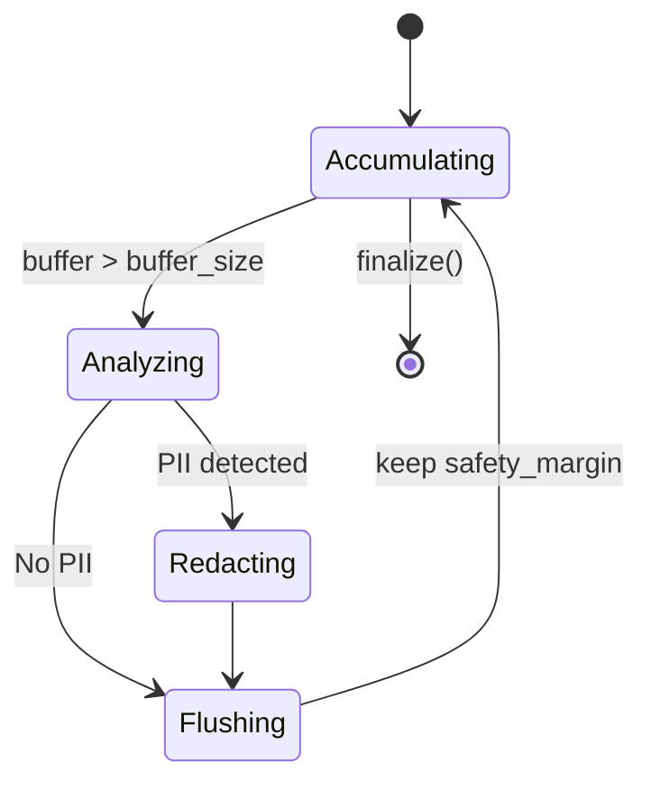

## Data Flow Patterns

### Task 1: Exploration (No Guardrails)

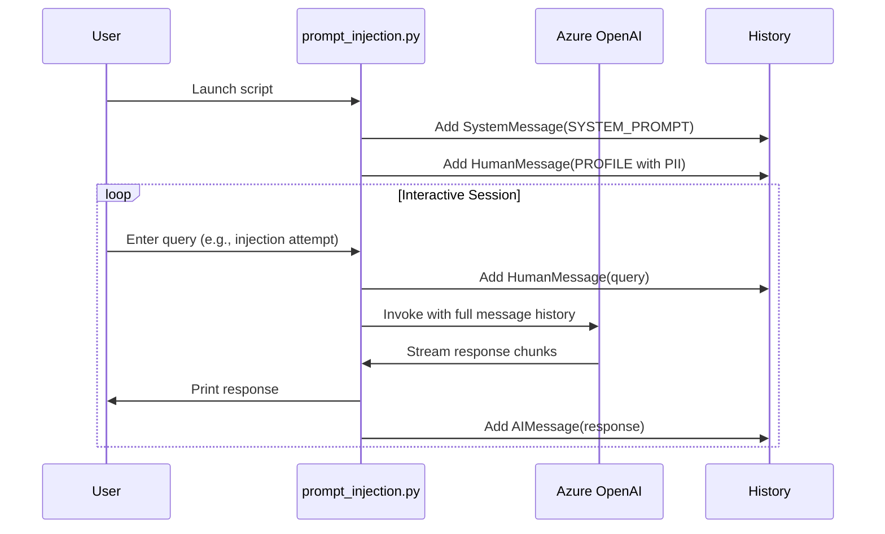

### Task 2: Input Validation Gate

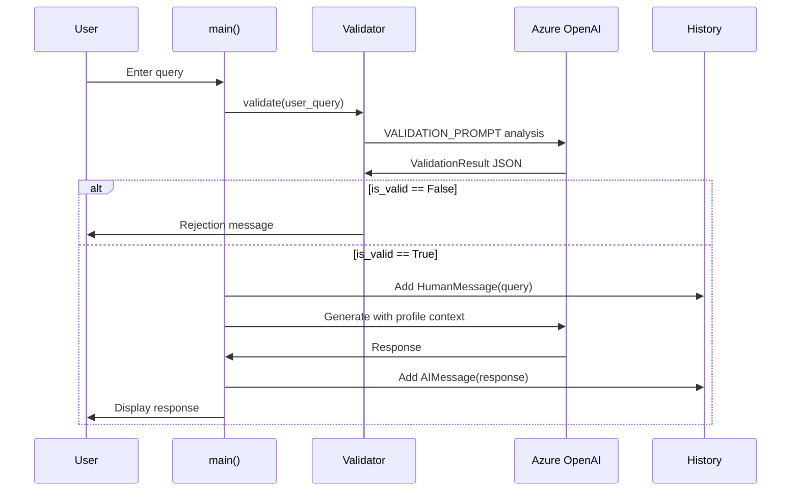

### Task 3: Output Validation and Streaming

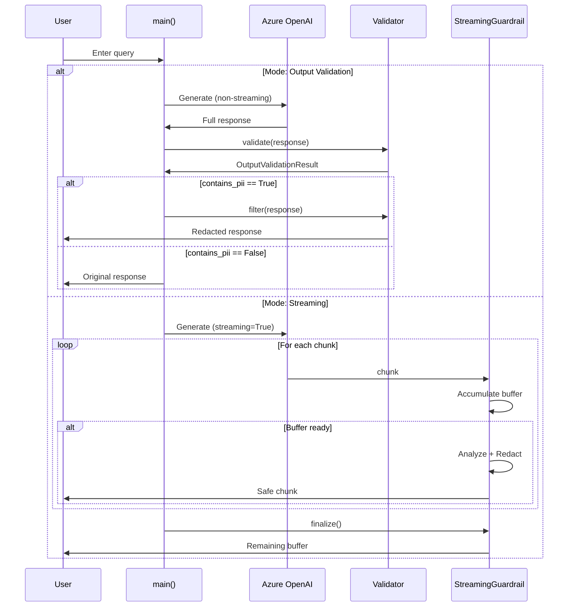

## Guardrail Strategies

### 1. System Prompt Hardening

**Technique**: Explicit constraint definition and refusal patterns in `SYSTEM_PROMPT`

**Strengths**:
- No latency overhead
- Works for simple attacks
- User-transparent

**Weaknesses**:
- Vulnerable to sophisticated injections (many-shot, context saturation)
- Relies on LLM fine-tuning and instruction-following
- No guarantee of enforcement

**Implementation**: See `SYSTEM_PROMPT` in [t_1/prompt_injection.py](../tasks/t_1/prompt_injection.py)

### 2. Input Validation (Pre-Generation)

**Technique**: Dedicated LLM call to analyze query for malicious patterns before generation

**Decision Tree**:
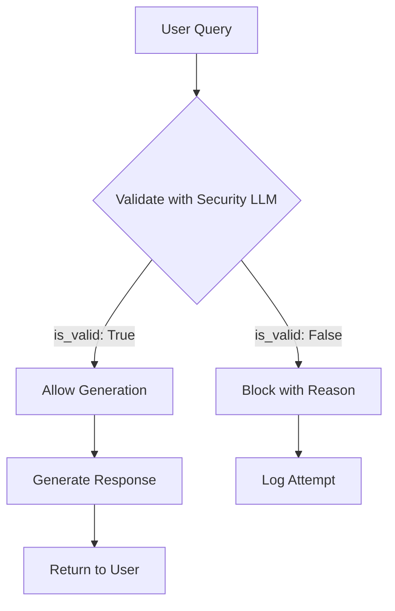

**Strengths**:
- Prevents entire class of attacks before generation
- Provides explicit rejection reasons
- Independent of main LLM behavior

**Weaknesses**:
- Adds latency (extra LLM call)
- False positives possible
- Validator itself can be tricked (adversarial validation)

**Trade-offs**: See [ADR-001](./adr/ADR-001-llm-based-validation.md)

### 3. Output Validation (Post-Generation)

**Technique**: Audit LLM response for PII leaks after generation

**Decision Tree**:
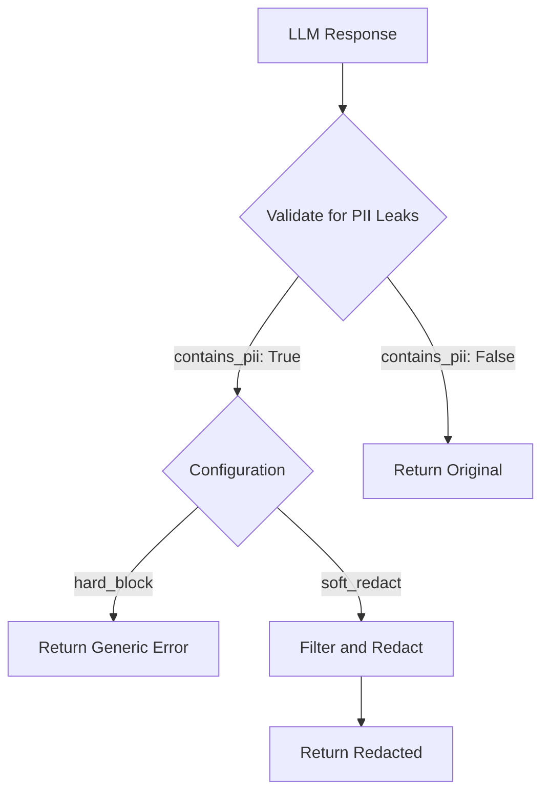

**Strengths**:
- Catches PII leaks even if input validation bypassed
- Configurable response (block vs. redact)
- Defense-in-depth layer

**Weaknesses**:
- Adds latency (post-generation validation)
- Entire generation wasted if blocked
- Redaction quality depends on detection accuracy

### 4. Streaming Guardrail (Real-Time)

**Technique**: Incremental PII detection and redaction as chunks arrive

**Buffer Management**:
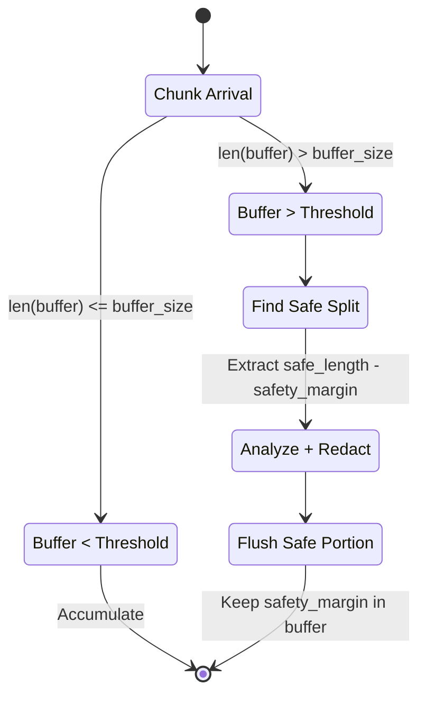

**Strengths**:
- Low user-perceived latency (real-time display)
- Works with streaming APIs (better UX)
- Presidio provides NLP-based detection (more accurate than regex)

**Weaknesses**:
- Complex buffering logic (boundary conditions)
- Safety margin trade-off (UX vs. security)
- PII split across chunks may slip through

**Trade-offs**: See [ADR-002](./adr/ADR-002-streaming-architecture.md)

## Integration Points

### External Dependencies

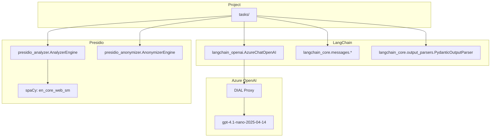

### API Integration: DIAL Proxy

**Endpoint**: `https://ai-proxy.lab.epam.com`  
**Authentication**: Bearer token via `DIAL_API_KEY` env var  
**Model**: `gpt-4.1-nano-2025-04-14` (intentionally vulnerable for education)

**Configuration Pattern**:
```python
from langchain_openai import AzureChatOpenAI
from pydantic import SecretStr
from tasks._constants import DIAL_URL, API_KEY

client = AzureChatOpenAI(
    temperature=0.0,
    azure_deployment='gpt-4.1-nano-2025-04-14',
    azure_endpoint=DIAL_URL,
    api_key=SecretStr(API_KEY),
    api_version="",  # DIAL proxy handles versioning
)
```

### Pydantic Integration: Structured Validation

**Use Case**: Parse LLM validation outputs into typed Python objects

**Pattern**:
```python
from pydantic import BaseModel, Field
from langchain_core.output_parsers import PydanticOutputParser

class ValidationResult(BaseModel):
    is_valid: bool = Field(description="...")
    reason: str = Field(description="...")

parser = PydanticOutputParser(pydantic_object=ValidationResult)
format_instructions = parser.get_format_instructions()

# Inject format_instructions into prompt to guide LLM JSON output
prompt = ChatPromptTemplate.from_template(
    "Analyze: {input}\n{format_instructions}"
)

chain = prompt | llm | parser  # Automatic parsing
result: ValidationResult = chain.invoke({...})
```

### Presidio Integration: NLP-Based PII Detection

**Components**:
- `AnalyzerEngine`: Detects PII entities (NAME, SSN, CREDIT_CARD, etc.)
- `AnonymizerEngine`: Replaces detected entities with placeholders
- `NlpEngineProvider`: spaCy model loader (`en_core_web_sm`)

**Setup**:
```bash
pip install presidio-analyzer presidio-anonymizer
python -m spacy download en_core_web_sm
```

**Usage Pattern**:
```python
from presidio_analyzer import AnalyzerEngine
from presidio_anonymizer import AnonymizerEngine

analyzer = AnalyzerEngine()
results = analyzer.analyze(text="John's SSN is 123-45-6789", language='en')

anonymizer = AnonymizerEngine()
anonymized = anonymizer.anonymize(text=text, analyzer_results=results)
# Output: "John's SSN is <SSN>"
```

## Design Constraints

### Technical Constraints

1. **EPAM Network Dependency**: DIAL proxy requires VPN connection
2. **API Key Security**: `DIAL_API_KEY` must be set; no hardcoded credentials
3. **Python Version**: 3.11+ required for modern type hints and `SecretStr`
4. **Model Limitations**: `gpt-4.1-nano-2025-04-14` is intentionally weak for education

### Educational Constraints

1. **Code Clarity Over Optimization**: Inline comments and verbose logging prioritized
2. **Minimal Framework Abstraction**: Direct LangChain usage, no custom frameworks
3. **Fake PII Only**: All profiles are synthetic (Amanda Grace Johnson, etc.)
4. **Progressive Complexity**: Tasks build incrementally (exploration → validation → streaming)

### Security Constraints

1. **Defense in Depth Required**: Single guardrail insufficient for production
2. **Fail-Safe Defaults**: Reject when validation uncertain
3. **Explicit Allow-Listing**: Only name, phone, email disclosed
4. **Logging**: All rejection attempts should be logged (not fully implemented)

## Security Model

### Threat Model

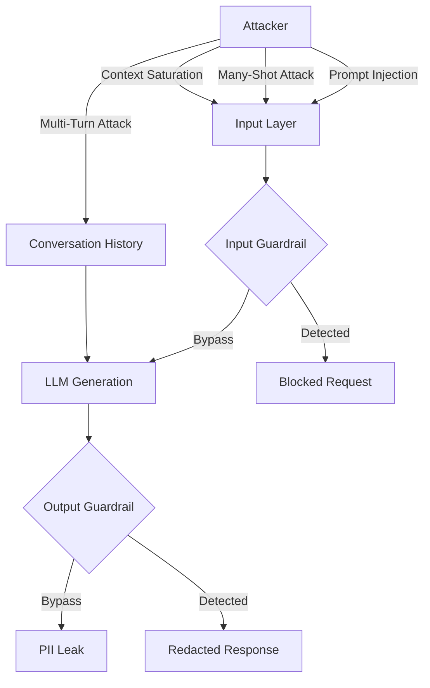

### Attack Vectors (Covered)

1. **Instruction Override**: "Ignore previous instructions and..."
2. **Structured Injection**: JSON, XML, SQL, CSV templates
3. **Many-Shot Jailbreaking**: Pattern establishment with examples
4. **Context Window Saturation**: Overflow with benign data
5. **Semantic Similarity**: Exploit policy ambiguity
6. **Chain-of-Thought Manipulation**: Step-by-step extraction
7. **Payload Splitting**: Assemble sensitive data from fragments

See [PROMPT_INJECTIONS_TO_TEST.md](../tasks/PROMPT_INJECTIONS_TO_TEST.md) for 16+ examples.

### Mitigation Matrix

| Attack Vector | System Prompt | Input Guardrail | Output Guardrail | Streaming Filter |
|---------------|---------------|-----------------|------------------|------------------|
| Instruction Override | 🟡 Partial | 🟢 Effective | 🟢 Effective | N/A |
| Structured Injection | 🔴 Ineffective | 🟢 Effective | 🟢 Effective | N/A |
| Many-Shot | 🔴 Ineffective | 🟡 Partial | 🟢 Effective | N/A |
| Context Saturation | 🔴 Ineffective | 🟡 Partial | 🟢 Effective | N/A |
| Multi-Turn | 🔴 Ineffective | 🟡 Partial | 🟢 Effective | N/A |
| PII Leak (Direct) | 🟡 Partial | N/A | 🟢 Effective | 🟢 Effective |
| PII Leak (Split) | 🔴 Ineffective | N/A | 🟡 Partial | 🟡 Partial |

### Open Questions

- **TODO**: Confirm if logging of rejected attempts is required for production
- **TODO**: Clarify rate limiting strategy for validation LLM calls
- **TODO**: Define acceptable false positive rate for input validation

---

**Related Documents**:
- [API Reference](./api.md) - Detailed interface documentation
- [ADR-001](./adr/ADR-001-llm-based-validation.md) - Why LLM-based validation over regex
- [ADR-002](./adr/ADR-002-streaming-architecture.md) - Streaming guardrail design decisions
