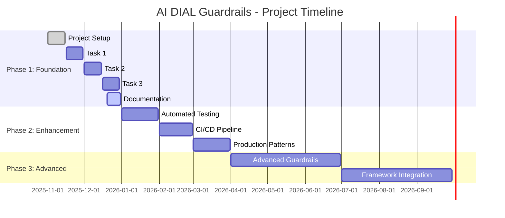

# Roadmap & Milestones

Project plan, milestones, backlog, and risk assessment for AI DIAL Guardrails.

## Table of Contents

- [Project Vision](#project-vision)
- [Current Status](#current-status)
- [Completed Milestones](#completed-milestones)
- [Upcoming Milestones](#upcoming-milestones)
- [Backlog](#backlog)
- [Risk Register](#risk-register)
- [Long-Term Vision](#long-term-vision)

---

## Project Vision

**Mission**: Provide hands-on educational materials demonstrating LLM security best practices through progressive guardrail implementation tasks.

**Goals**:
1. Teach prompt injection defense strategies
2. Demonstrate layered security architecture (defense-in-depth)
3. Show practical implementation patterns (LangChain, Presidio)
4. Prepare developers for production LLM application security

**Target Audience**:
- Software engineers learning LLM security
- Security engineers adding LLM guardrails to applications
- ML engineers integrating safety layers
- Product managers understanding LLM security trade-offs

---

## Current Status

**Version**: 1.0.0 (Educational Foundation)  
**Status**: ✅ Core implementation complete  
**Last Updated**: 2025-12-31

### Completion Overview

### Feature Matrix

| Feature | Status | Priority | Notes |
|---------|--------|----------|-------|
| **Task 1: Prompt Injection REPL** | ✅ Complete | High | Interactive exploration tool |
| **Task 2: Input Validation** | ✅ Complete | High | LLM-based detection |
| **Task 3A: Output Validation** | ✅ Complete | High | Hard/soft modes |
| **Task 3B: Streaming Guardrail** | ✅ Complete | High | Regex + Presidio |
| **Attack Examples** | ✅ Complete | High | 16+ documented attacks |
| **Documentation** | ✅ Complete | High | Architecture, API, ADRs |
| **Automated Tests** | 🚧 TODO | Medium | Unit + integration tests |
| **CI/CD Pipeline** | 🚧 TODO | Medium | GitHub Actions |
| **Performance Benchmarks** | 🚧 TODO | Low | Latency/accuracy metrics |
| **Production Patterns** | 🚧 TODO | Medium | Caching, rate limiting |
| **Advanced Guardrails** | 📋 Planned | Low | Semantic validation, embeddings |
| **Framework Integration** | 📋 Planned | Low | guardrails-ai, NeMo |

---

## Completed Milestones

### Milestone 1: Project Foundation (✅ Nov 2025)

**Objectives**:
- Set up repository structure
- Configure DIAL API integration
- Document project scope and goals

**Deliverables**:
- ✅ README.md with project overview
- ✅ requirements.txt with dependencies
- ✅ tasks/_constants.py for API config
- ✅ .github/copilot-instructions.md

**Outcomes**: Foundation established for task development.

---

### Milestone 2: Task 1 - Prompt Injection Exploration (✅ Nov 2025)

**Objectives**:
- Demonstrate prompt injection vulnerabilities
- Implement system prompt hardening
- Create interactive testing REPL

**Deliverables**:
- ✅ tasks/t_1/prompt_injection.py
- ✅ SYSTEM_PROMPT with security constraints
- ✅ PROFILE with fake PII (Amanda Grace Johnson)
- ✅ Interactive REPL for attack testing

**Outcomes**: Users understand attack vectors and system prompt limitations.

---

### Milestone 3: Task 2 - Input Validation (✅ Dec 2025)

**Objectives**:
- Implement LLM-based input validator
- Use Pydantic for structured validation output
- Block malicious queries before generation

**Deliverables**:
- ✅ tasks/t_2/input_llm_based_validation.py
- ✅ ValidationResult Pydantic model
- ✅ VALIDATION_PROMPT_TEMPLATE
- ✅ validate() function with LLM chain

**Outcomes**: Defense-in-depth layer blocks prompt injection at input.

**Design Decisions**: [ADR-001: LLM-Based Validation](./adr/ADR-001-llm-based-validation.md)

---

### Milestone 4: Task 3 - Output Validation & Streaming (✅ Dec 2025)

**Objectives**:
- Implement output validation for PII leaks
- Create streaming guardrail with buffering
- Integrate Presidio for NLP-based detection

**Deliverables**:
- ✅ tasks/t_3/output_llm_based_validation.py
- ✅ OutputValidationResult Pydantic model
- ✅ Hard/soft response modes
- ✅ StreamingPIIGuardrail (regex-based)
- ✅ PresidioStreamingPIIGuardrail (NLP-based)
- ✅ Buffer management with safety margin

**Outcomes**: Complete guardrail flow demonstrated (input → generation → output).

**Design Decisions**: 
- [ADR-002: Streaming Architecture](./adr/ADR-002-streaming-architecture.md)
- [ADR-004: Presidio Integration](./adr/ADR-004-presidio-integration.md)

---

### Milestone 5: Attack Examples & Documentation (✅ Dec 2025)

**Objectives**:
- Document comprehensive attack patterns
- Create reference examples for testing
- Provide architecture and API documentation

**Deliverables**:
- ✅ tasks/PROMPT_INJECTIONS_TO_TEST.md (16+ attacks)
- ✅ docs/README.md (documentation index)
- ✅ docs/architecture.md (system design)
- ✅ docs/setup.md (environment setup)
- ✅ docs/api.md (interface reference)
- ✅ docs/testing.md (test strategy)
- ✅ docs/glossary.md (terminology)
- ✅ docs/adr/ (4 decision records)

**Outcomes**: Comprehensive documentation for onboarding and reference.

---

## Upcoming Milestones

### Milestone 6: Automated Testing (📅 Jan 2026)

**Status**: 🚧 TODO  
**Priority**: High  
**Estimated Effort**: 2-3 weeks

**Objectives**:
- Implement unit tests for all guardrails
- Create integration tests for full conversation flows
- Achieve 80%+ code coverage

**Planned Deliverables**:
- [ ] tests/unit/test_input_validation.py
- [ ] tests/unit/test_output_validation.py
- [ ] tests/unit/test_streaming_guardrail.py
- [ ] tests/integration/test_full_conversation.py
- [ ] tests/integration/test_prompt_injection_defense.py
- [ ] pytest configuration (pytest.ini, conftest.py)
- [ ] Test fixtures (attack patterns, PII examples)
- [ ] Coverage report (HTML)

**Success Criteria**:
- All tests pass on clean environment
- Coverage > 80% for tasks/ modules
- All 16+ attack patterns tested
- False positive/negative rates measured

**Dependencies**: None (can start immediately)

**Risks**: 
- DIAL API access required for integration tests
- LLM responses non-deterministic (may need mocking)

---

### Milestone 7: CI/CD Pipeline (📅 Feb 2026)

**Status**: 🚧 TODO  
**Priority**: Medium  
**Estimated Effort**: 1-2 weeks

**Objectives**:
- Automate testing on commit/PR
- Set up linting and formatting checks
- Generate coverage reports automatically

**Planned Deliverables**:
- [ ] .github/workflows/test.yml (GitHub Actions)
- [ ] .github/workflows/lint.yml (flake8, black)
- [ ] Pre-commit hooks configuration
- [ ] Automated coverage badge
- [ ] Test result publishing

**Success Criteria**:
- Tests run automatically on every PR
- Linting enforced (black, flake8)
- Coverage reports generated and tracked
- Failing tests block merges

**Dependencies**: Milestone 6 (Automated Testing)

**Risks**:
- DIAL API access in CI environment (may need mocking)
- Secret management for DIAL_API_KEY

---

### Milestone 8: Performance Benchmarks (📅 Mar 2026)

**Status**: 🚧 TODO  
**Priority**: Low  
**Estimated Effort**: 1 week

**Objectives**:
- Measure latency for each guardrail layer
- Compare regex vs. Presidio accuracy
- Document performance trade-offs

**Planned Deliverables**:
- [ ] benchmarks/latency_benchmark.py
- [ ] benchmarks/accuracy_benchmark.py
- [ ] Performance report (Markdown)
- [ ] Recommendations for optimization

**Success Criteria**:
- Latency measured for all components
- Accuracy (precision/recall/F1) measured
- Trade-offs documented (speed vs. accuracy)

**Dependencies**: Milestone 6 (Automated Testing)

---

### Milestone 9: Production Patterns (📅 Q2 2026)

**Status**: 📋 Planned  
**Priority**: Medium  
**Estimated Effort**: 3-4 weeks

**Objectives**:
- Add caching for validation results
- Implement rate limiting
- Add logging and monitoring
- Create deployment guide

**Planned Deliverables**:
- [ ] Caching layer (Redis/in-memory)
- [ ] Rate limiter implementation
- [ ] Structured logging (JSON)
- [ ] Monitoring dashboard (Grafana)
- [ ] Deployment guide (Docker, K8s)
- [ ] Production checklist

**Success Criteria**:
- Caching reduces validation latency by 50%+
- Rate limiting prevents abuse
- Logs structured and queryable
- Deployment guide tested on staging

**Dependencies**: Milestone 6 (Automated Testing)

---

## Backlog

### High Priority

1. **Unit Tests for All Tasks** (Milestone 6)
   - Comprehensive test coverage
   - Test fixtures and helpers
   - Mock LLM responses for deterministic tests

2. **Integration Tests** (Milestone 6)
   - End-to-end conversation flows
   - Attack pattern validation
   - Multi-turn attack scenarios

3. **CI/CD Pipeline** (Milestone 7)
   - Automated testing on PR
   - Linting and formatting checks
   - Coverage tracking

### Medium Priority

4. **Performance Benchmarks** (Milestone 8)
   - Latency measurements
   - Accuracy comparison (regex vs. Presidio)
   - Resource usage profiling

5. **Caching Layer** (Milestone 9)
   - Cache validation results
   - TTL-based invalidation
   - Reduce duplicate LLM calls

6. **Rate Limiting** (Milestone 9)
   - Per-user rate limits
   - Global rate limits
   - Backpressure handling

7. **Monitoring & Logging** (Milestone 9)
   - Structured logging (JSON)
   - Metrics collection (Prometheus)
   - Alerting rules

### Low Priority

8. **Advanced Guardrails**
   - Semantic similarity validation (embeddings)
   - Adversarial training for validators
   - Multi-model ensemble validation

9. **Framework Integration**
   - guardrails-ai integration
   - NVIDIA NeMo Guardrails integration
   - LangChain Guardrail abstraction

10. **Multi-Language Support**
    - Spanish, French, German profiles
    - Multi-language spaCy models
    - Language-specific attack patterns

11. **Web UI**
    - Interactive dashboard
    - Visual attack demonstration
    - Real-time guardrail visualization

12. **Video Tutorials**
    - Walkthrough videos for each task
    - Attack technique explanations
    - Setup and troubleshooting guides

---

## Risk Register

### High-Impact Risks

#### Risk 1: DIAL API Dependency

**Description**: Project requires EPAM internal DIAL API access.  
**Impact**: High (project unusable without DIAL access)  
**Likelihood**: Medium (DIAL downtime, API changes)  
**Mitigation**:
- Document fallback to direct Azure OpenAI
- Create mock LLM responses for testing
- Add retry logic and error handling

**Status**: Monitoring

---

#### Risk 2: LLM Non-Determinism

**Description**: LLM responses vary across runs, complicating testing.  
**Impact**: Medium (flaky tests, hard to debug)  
**Likelihood**: High (inherent LLM behavior)  
**Mitigation**:
- Use temperature=0.0 for deterministic responses
- Mock LLM responses in unit tests
- Use integration tests for real LLM behavior
- Accept some variance in assertions

**Status**: Mitigated

---

#### Risk 3: Presidio Version Compatibility

**Description**: Presidio API changes across versions.  
**Impact**: Medium (code breaks on upgrades)  
**Likelihood**: Medium (active development)  
**Mitigation**:
- Multiple fallback strategies in initialization
- Pin Presidio version in requirements.txt
- Document tested versions

**Status**: Mitigated

---

### Medium-Impact Risks

#### Risk 4: False Positive Rate

**Description**: Input validation blocks legitimate queries.  
**Impact**: Medium (poor UX, user frustration)  
**Likelihood**: Medium (depends on validation prompt quality)  
**Mitigation**:
- Test with diverse legitimate query corpus
- Tune validation prompt iteratively
- Provide feedback mechanism for users
- Track false positive metrics

**Status**: Monitoring

---

#### Risk 5: Performance Bottlenecks

**Description**: Multiple LLM calls add unacceptable latency.  
**Impact**: Medium (poor UX, timeout issues)  
**Likelihood**: Medium (cumulative validation delay)  
**Mitigation**:
- Implement caching layer
- Optimize validation prompts
- Use faster models for validation
- Parallel processing where possible

**Status**: Accepted (educational context)

---

### Low-Impact Risks

#### Risk 6: Documentation Staleness

**Description**: Code changes not reflected in documentation.  
**Impact**: Low (confusion, onboarding friction)  
**Likelihood**: Medium (documentation drift)  
**Mitigation**:
- Include documentation updates in PR checklist
- Automated checks for inline comment coverage
- Regular documentation review cycles

**Status**: Monitoring

---

## Long-Term Vision

### Phase 4: Advanced Security (2026 Q3-Q4)

**Goals**:
- Implement semantic validation using embeddings
- Add adversarial training for validators
- Create multi-model ensemble validation
- Integrate threat intelligence feeds

**Potential Features**:
- Real-time threat detection
- Adaptive guardrails (learn from attacks)
- Cross-session attack correlation
- Automated guardrail tuning

---

### Phase 5: Production Frameworks (2027)

**Goals**:
- Integrate with guardrails-ai framework
- Support NVIDIA NeMo Guardrails
- Create LangChain Guardrail abstraction
- Publish reusable guardrail components

**Potential Outcomes**:
- Open-source guardrail library
- Community contributions
- Industry adoption
- Conference presentations

---

### Phase 6: Research & Innovation (2027+)

**Goals**:
- Research novel guardrail techniques
- Publish academic papers
- Collaborate with security research community
- Explore LLM safety frontiers

**Potential Topics**:
- Formal verification of guardrails
- Quantum-resistant PII detection
- Zero-knowledge guardrail validation
- Federated guardrail learning

---

## Success Metrics

### Educational Effectiveness

- **Users Trained**: Target 100+ developers by end of 2026
- **Completion Rate**: > 80% of users complete all 3 tasks
- **Feedback Score**: > 4.0/5.0 average satisfaction
- **Time to Complete**: < 4 hours for all tasks

### Technical Quality

- **Test Coverage**: > 80% code coverage
- **Bug Density**: < 1 bug per 1000 LOC
- **Documentation Coverage**: 100% of public APIs documented
- **Performance**: Validation latency < 2 seconds per layer

### Community Impact

- **GitHub Stars**: Target 50+ by end of 2026
- **Forks**: Target 20+ by end of 2026
- **Contributors**: Target 5+ external contributors
- **Citations**: Target 3+ academic/industry references

---

## Contributing to Roadmap

### Propose New Features

1. Open GitHub Issue with feature proposal
2. Describe use case and benefits
3. Link to related ADRs if applicable
4. Tag with `enhancement` label

### Report Bugs or Issues

1. Open GitHub Issue with bug description
2. Include reproduction steps
3. Tag with `bug` label
4. Link to relevant documentation

### Submit Pull Requests

1. Check backlog for open issues
2. Comment on issue to claim work
3. Follow [Copilot Instructions](../.github/copilot-instructions.md) for code style
4. Include tests and documentation updates
5. Reference issue in PR description

---

**Related Documents**:
- [Architecture](./architecture.md) - System design context
- [Testing](./testing.md) - Test strategy details
- [ADR Directory](./adr/) - Design decisions
